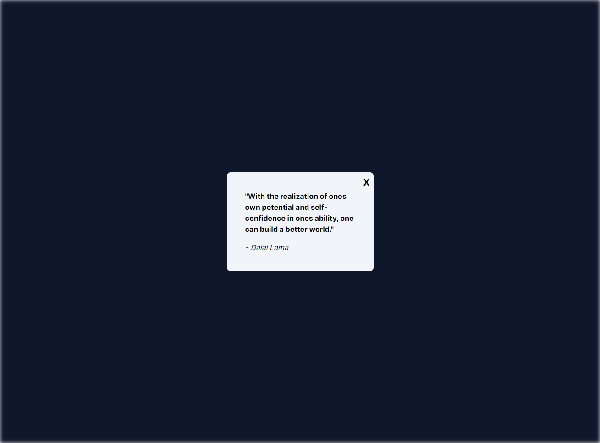

<h1 align="center">
  💻 RANDOM QUOTES
</h1>
<h1 align="center">
  
</h1>

## 📑 Sobre

O projeto consiste em utilizar uma API de frases, para imprimi-las na tela de forma aleatória.

## 🚀 Tecnologias utilizadas

- 💻 React, Next.js, TypeScript, Tailwind CSS, Axios

---
## 🧑‍💻 Autor

<table>
  <tr>
    <td align="center">
      <a href="github.com/guixavier77">
         
        
          <b>Guilherme Xavier</b>
        
      </a>
    </td>
  </tr>
</table>